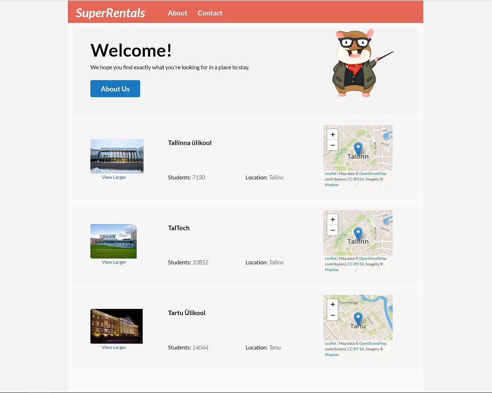

# Ember
https://emberjs.com 

teisipäevase grupi tunnis tehtud näide: https://github.com/veebiraamistikud-2019/Ember/pull/1

Teisipäevase grupi näitele lisatud ülikoolide asukoha kuvamine kaardil. Kasutatud Ember Leafleti lisa, mis kasutab MapBox API-t.

Enne käivitamist lisada MapBox API key:
set LEAFLET_MAPS_API_KEY=API key

käivitamiseks:
ember serve

